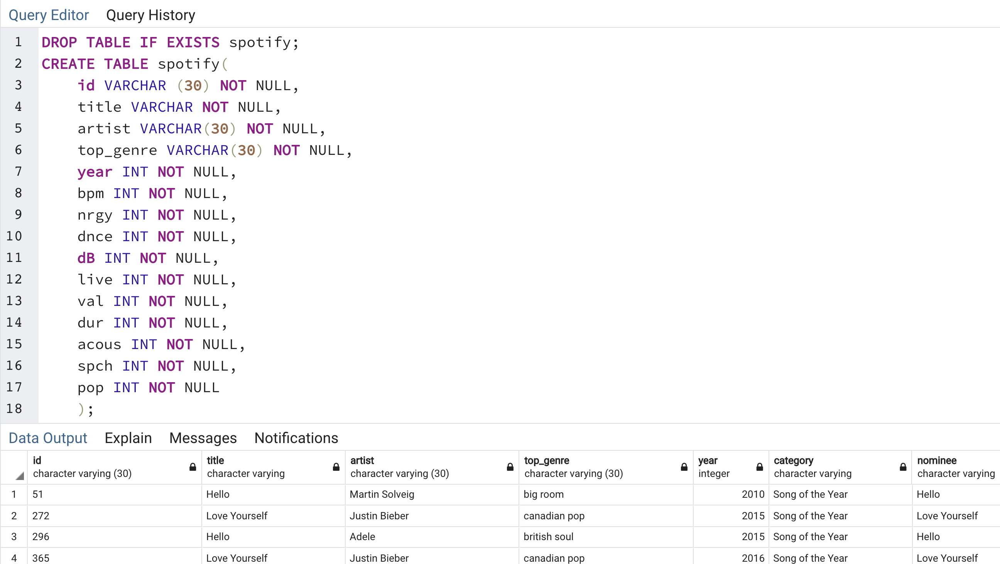
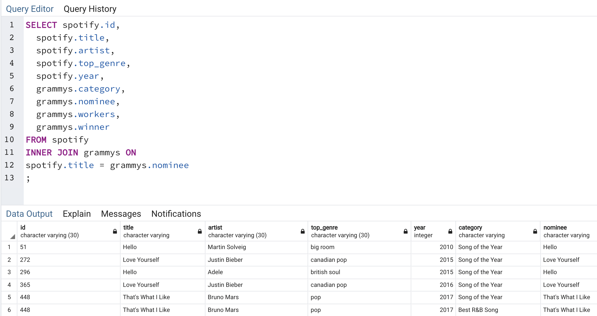

# ETL Project | Group 4

## Team
* Kara
* Bean
* Anna

## Table of Contents
* [Objective](#Objective)
* [Technologies](#Technologies)
* [ETL](#ETL)
* [Troubleshooting](#Troubleshooting)

# Objective | Create a Database Utilizing ETL on Real Datasets
Organize data from multiple databases in order to determine similar characteristics of Grammy-winning songs between the years of 2010 and 2019 per streaming platform Spotify.

Our final production table combines the Grammy song nominations and winners from 2010 - 2019 with the top Spotify tracks for the same years. (spotify_join_grammy.csv)

# Technologies
* Pandas
* Python3
* PostgreSQL

# ETL
## Process Documentation

Our datasets were obtained on Kaggle at the following links:

* [Top Spotify Songs 2010-2019](https://www.kaggle.com/leonardopena/top-spotify-songs-from-20102019-by-year)

* [Grammy Awards](https://www.kaggle.com/unanimad/grammy-awards)

## E | Extract
* Downloaded both CSV datasets 
* Read in CSV data in a Jupyter notebook file with Pandas
       
       '''
        grammy_df=pd.read_csv('the_grammy_awards.csv')
        grammy_df.head()
       '''
## T | Transform

 
   Limited the Grammy dataset to only include Awards that were given to *songs*
      
      '''
       song_df=grammy_df[grammy_df['category'].str.contains('Song')]
       '''
      
   Reduced dataset to years 2010 - 2019 to more acurately compare with the obtained Spotify dataset
      
      '''
      grammy_df = grammy_df.loc[grammy_df["year"]> 2009]
      grammy_df.head()
      '''
      
  Spotify Dataset proved to have high quality data, however, when importing the CSV into PgAdmin4 we ran into an unknown/foreign character UTF8 error and the file could not import. We resolved this error by noting the encoding type to LATIN1. 
  
  In this stage we uncovered the relational structure of our datasets is the Song/Track's Name. This information was located in Grammy's nominee column and Spotify's title column. 
  
## L | Load

We decided to work in PostgreSQL due to the relational structure of our datasets. 

Our final production table combines the Grammy song nominations and winners from 2010 - 2019 and the top Spotify tracks for the same years. 
Our database can be used with SQLAlchemy to query the information and return results like, number of nominations/awards per artist, and furthermore, could be used to compare the success of a track based on tempo, decibels, and genre. 

### Steps: Tables/Collections

Grammy 
	Created table with the following columns: 
   
     '''
      DROP TABLE IF EXISTS grammy;
         CREATE TABLE grammy(
           year INT NOT NULL,
           category VARCHAR NOT NULL,
           title VARCHAR NOT NULL,
           workers VARCHAR NOT NULL,
           winner VARCHAR NOT NULL
           );
      '''
Spotify 
Created table with the following columns: 

We used the JOIN function to combine our two tables into the database. More specifically, we used an INNER JOIN to combine the information under *nominee* (Grammy) and *title* (Spotify).

# Troubleshooting

* Started with ambition to work with API's - Spotify, Apple Music, and Youtube. 
	* Note, the Spotify dataset on Kaggle indicates the information was obtained by Spotify's API
* Changed course to work with existing csv data for the purpose of the ETL project
* While working with API's the main challenges were working with all the necessary components and downloading all the suggested packages we were unfamiliar with using

